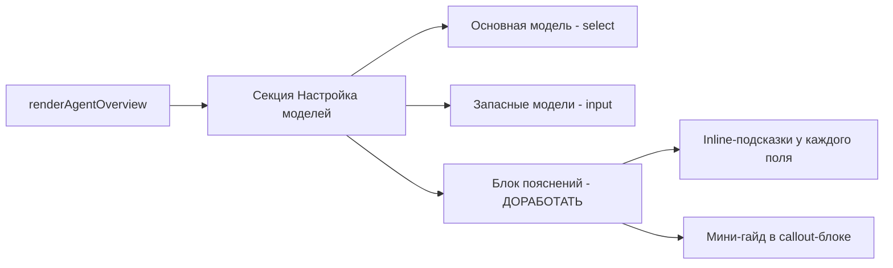

# План: P2 — Доработка UX вкладки «Агенты»: упрощение объяснения моделей

**Дата:** 2026-02-22  
**Приоритет:** P2  
**Статус:** Планирование  
**Оценка:** ~1 час  

---

## Контекст

Во вкладке «Агенты» → «Обзор» пользователь видит секцию «Настройка моделей» с двумя полями:
- «Основная модель ответа»
- «Запасные модели (если основная недоступна)»

**Проблема:** Текущее объяснение внизу формы — одна строка мелким шрифтом. Пользователям не хватает контекста:
- Что такое «основная модель» и зачем она?
- Зачем нужны «запасные» — что произойдёт при недоступности основной?
- Какой формат ввода для запасных моделей?

**Файл:** `ui/src/ui/views/agents.ts`  
**Текущий текст (строки 913–914):**
```
Основная — модель, которой агент отвечает в первую очередь.
Запасные — необязательно, используются при временной недоступности основной.
```

---

## Архитектура изменений

Изменения затрагивают только один файл: `ui/src/ui/views/agents.ts`, функция `renderAgentOverview`, строки 874–932.



---

## Задачи

### Задача 1: Добавить inline-подсказки к каждому полю

**Файл:** `ui/src/ui/views/agents.ts`  
**Строки:** 877–911

**Текущее состояние:** У полей есть только `<span>` с названием.

**Целевое состояние:** Под каждым `<select>` / `<input>` добавить `<div class="muted">` с коротким пояснением.

#### Для «Основная модель ответа»:

Под `<select>` (после строки 896) добавить:
```html
<div class="muted" style="margin-top: 4px;">
  Модель ИИ, которая отвечает на ваши сообщения. Выберите из списка настроенных провайдеров.
</div>
```

#### Для «Запасные модели»:

Под `<input>` (после строки 908) добавить:
```html
<div class="muted" style="margin-top: 4px;">
  Через запятую. Используются автоматически, если основная модель временно недоступна. Необязательно.
</div>
```

### Задача 2: Заменить общий текст на структурированный callout

**Файл:** `ui/src/ui/views/agents.ts`  
**Строки:** 912–915

**Текущий код:**
```typescript
<div class="muted" style="margin-top: 8px;">
  Основная — модель, которой агент отвечает в первую очередь.
  Запасные — необязательно, используются при временной недоступности основной.
</div>
```

**Заменить на:**
```typescript
<div class="callout info" style="margin-top: 12px;">
  <div style="font-weight: 500; margin-bottom: 4px;">💡 Как работают модели</div>
  <ul style="margin: 0; padding-left: 20px; line-height: 1.6;">
    <li><strong>Основная модель</strong> — ИИ, который отвечает на ваши сообщения в первую очередь.</li>
    <li><strong>Запасные модели</strong> — подключаются автоматически, если основная временно недоступна (например, перегрузка API). Заполнять необязательно.</li>
    <li><strong>Формат запасных:</strong> <code>provider/model-name</code>, через запятую. Пример: <code>openai/gpt-5-mini, google/gemini-3-flash-preview</code></li>
  </ul>
</div>
```

### Задача 3: Добавить placeholder с примером в поле запасных моделей

**Файл:** `ui/src/ui/views/agents.ts`  
**Строка:** 904

**Текущее:**
```typescript
placeholder="provider/model, provider/model"
```

**Заменить на:**
```typescript
placeholder="openai/gpt-5-mini, google/gemini-3-flash-preview"
```

Конкретные имена моделей более понятны, чем абстрактный шаблон.

### Задача 4: Улучшить label для select основной модели

**Файл:** `ui/src/ui/views/agents.ts`  
**Строка:** 878

**Текущее:**
```typescript
<span>Основная модель ответа${isDefault ? " (по умолчанию)" : ""}</span>
```

**Оставить как есть** — текст уже хороший.

### Задача 5: Визуальная проверка

1. Открыть UI → вкладка «Агенты» → выбрать агента → «Обзор»
2. Проверить что:
   - Inline-подсказки видны под каждым полем
   - Callout-блок с гайдом не перегружает интерфейс
   - На мобильных/узких экранах callout не ломает layout
3. Проверить dark mode (если поддерживается)

---

## Мокап результата

```
┌─────────────────────────────────────────────────────────┐
│ Настройка моделей                                       │
├─────────────────────────────────────────────────────────┤
│ Основная модель ответа (по умолчанию)                   │
│ ┌─────────────────────────────────────────────────┐     │
│ │ openrouter/moonshotai/kimi-k2.5             ▼  │     │
│ └─────────────────────────────────────────────────┘     │
│ Модель ИИ, которая отвечает на ваши сообщения.          │
│                                                         │
│ Запасные модели (если основная недоступна)               │
│ ┌─────────────────────────────────────────────────┐     │
│ │ openai/gpt-5-mini, google/gemini-3-flash-pre.. │     │
│ └─────────────────────────────────────────────────┘     │
│ Через запятую. Необязательно.                           │
│                                                         │
│ ┌─ 💡 Как работают модели ──────────────────────────┐   │
│ │ • Основная — ИИ, отвечающий первым.               │   │
│ │ • Запасные — при недоступности основной.           │   │
│ │ • Формат: provider/model-name, через запятую.     │   │
│ └───────────────────────────────────────────────────┘   │
│                                                         │
│                          [Обновить конфиг] [Сохранить]  │
└─────────────────────────────────────────────────────────┘
```

---

## Затрагиваемые файлы

| Файл | Тип изменения |
|------|--------------|
| `ui/src/ui/views/agents.ts` | Modify — функция `renderAgentOverview`, строки 874–932 |

---

## Риски

| Риск | Вероятность | Митигация |
|------|------------|-----------|
| Callout-блок слишком большой | Низкая | Используем `<ul>` для компактности, можно спрятать в `<details>` |
| Перевод примеров моделей устареет | Средняя | Использовать актуальные alias из `DEFAULT_MODEL_ALIASES` |
| Стили `.callout.info` не определены | Низкая | Проверить `ui/src/styles/components.css` |