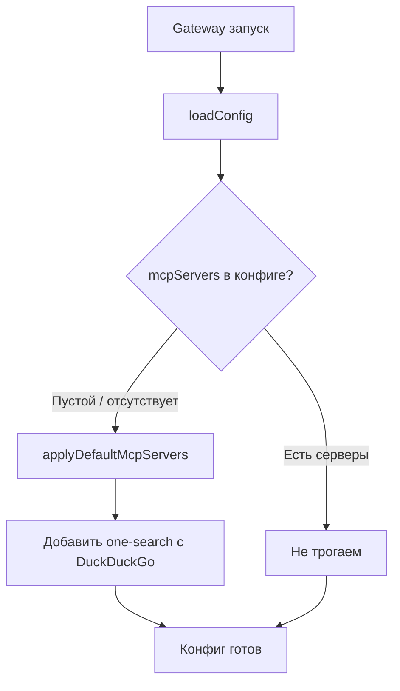

# План: P1 — Автоматическая регистрация one-search-mcp

**Дата:** 2026-02-22  
**Приоритет:** P1  
**Статус:** Планирование  
**Оценка:** ~1.5 часа  

---

## Контекст

Пользователи должны вручную добавлять MCP-сервер для поиска в интернете в `~/.YA-yagent/openclaw.json`. Цель — автоматически регистрировать `one-search-mcp` (DuckDuckGo, без API-ключей) при первом запуске, если пользователь ещё не настроил MCP-серверы.

**Существующие документы:**
- Дизайн: `docs/plans/2026-02-22-compaction-onsearch-design.md`
- Реализация: `docs/plans/2026-02-22-compaction-onsearch-implementation.md`

**Текущее состояние:**
- `applyCompactionDefaults` уже реализована в `src/config/defaults.ts` (строки 443–480)
- `applyDefaultMcpServers` **НЕ существует** — нужно создать
- В `src/config/io.ts` цепочка defaults вызывается в двух местах:
  - `loadConfig()` → строки 294–302 (вложенные вызовы)
  - `readConfigFileSnapshot()` → строки 355–363 (без файла) и 478–483 (с файлом)
- В обоих местах `applyDefaultMcpServers` **не вызывается**

---

## Архитектура

```
src/config/defaults.ts
├── applyCompactionDefaults()     # ✅ уже есть
└── applyDefaultMcpServers()      # ❌ НУЖНО СОЗДАТЬ

src/config/io.ts
├── loadConfig() → добавить applyDefaultMcpServers в цепочку
└── readConfigFileSnapshot() → добавить applyDefaultMcpServers в цепочку
```

Блок-схема:



---

## Задачи

### Задача 1: Создать функцию `applyDefaultMcpServers`

**Файл:** `src/config/defaults.ts`  
**Место:** После функции `applyCompactionDefaults` (после строки 480)

**Логика:**
1. Если `cfg.mcpServers` уже содержит хотя бы один сервер — не трогаем
2. Если пусто/отсутствует — добавляем блок `one-search`

```typescript
export function applyDefaultMcpServers(cfg: OpenClawConfig): OpenClawConfig {
  // Если пользователь уже настроил MCP-серверы — не трогаем
  if (cfg.mcpServers && Object.keys(cfg.mcpServers).length > 0) {
    return cfg;
  }

  return {
    ...cfg,
    mcpServers: {
      ...cfg.mcpServers,
      "one-search": {
        command: "npx",
        args: ["-y", "one-search-mcp"],
        env: {
          SEARCH_PROVIDER: "duckduckgo",
        },
      },
    },
  };
}
```

**Важные детали:**
- Не перезаписывать существующие серверы (merge, не override)
- Использовать `npx -y` для автоустановки без промпта
- Провайдер DuckDuckGo не требует API-ключей

### Задача 2: Проверить типы для mcpServers в OpenClawConfig

**Файл:** `src/config/types.openclaw.ts` или `src/config/types.ts`  
**Действие:** Убедиться что `mcpServers` есть в типе `OpenClawConfig`  

Найти определение и проверить наличие поля. Если отсутствует — добавить:
```typescript
mcpServers?: Record<string, {
  command: string;
  args?: string[];
  env?: Record<string, string>;
}>;
```

### Задача 3: Добавить в цепочку defaults в `loadConfig`

**Файл:** `src/config/io.ts`  
**Строки:** 294–302

**Текущий код:**
```typescript
const cfg = applyModelDefaults(
  applyCompactionDefaults(
    applyContextPruningDefaults(
      applyAgentDefaults(
        applySessionDefaults(applyLoggingDefaults(applyMessageDefaults(validated.config))),
      ),
    ),
  ),
);
```

**Новый код:**
```typescript
const cfg = applyDefaultMcpServers(
  applyModelDefaults(
    applyCompactionDefaults(
      applyContextPruningDefaults(
        applyAgentDefaults(
          applySessionDefaults(applyLoggingDefaults(applyMessageDefaults(validated.config))),
        ),
      ),
    ),
  ),
);
```

### Задача 4: Добавить в цепочку defaults в `readConfigFileSnapshot` (без файла)

**Файл:** `src/config/io.ts`  
**Строки:** 355–363

**Текущий код:**
```typescript
const config = applyTalkApiKey(
  applyModelDefaults(
    applyCompactionDefaults(
      applyContextPruningDefaults(
        applyAgentDefaults(applySessionDefaults(applyMessageDefaults({}))),
      ),
    ),
  ),
);
```

**Добавить `applyDefaultMcpServers` в цепочку аналогично.**

### Задача 5: Добавить в цепочку defaults в `readConfigFileSnapshot` (с файлом)

**Файл:** `src/config/io.ts`  
**Строки:** 478–483

**Текущий код в return:**
```typescript
config: normalizeConfigPaths(
  applyTalkApiKey(
    applyModelDefaults(
      applyAgentDefaults(
        applySessionDefaults(applyLoggingDefaults(applyMessageDefaults(validated.config))),
      ),
    ),
  ),
),
```

**Добавить `applyDefaultMcpServers` аналогично.**

### Задача 6: Добавить import в io.ts

**Файл:** `src/config/io.ts`  
**Строка:** 19 (блок импорта из defaults.js)

Добавить `applyDefaultMcpServers` в список импортов.

### Задача 7: Написать тест

**Файл:** `src/config/config.web-search-provider.test.ts` или новый `src/config/config.default-mcp-servers.test.ts`

**Тест-кейсы:**
1. Пустой конфиг → добавляется `one-search`
2. Конфиг с существующими mcpServers → ничего не меняется
3. Конфиг с `one-search` уже присутствующим → ничего не меняется
4. Конфиг с другими серверами → не трогаем

### Задача 8: Интеграционная проверка

1. Удалить `~/.YA-yagent` (чистый профиль)
2. Запустить gateway
3. Проверить что в `~/.YA-yagent/openclaw.json` появился блок mcpServers
4. Проверить что поиск работает из чата

---

## Риски

| Риск | Вероятность | Митигация |
|------|------------|-----------|
| `npx` не найден в PATH | Средняя | MCP graceful degradation — сервер не запустится, но gateway работает |
| `one-search-mcp` пакет недоступен | Низкая | npx скачает при первом вызове; без интернета — не работает |
| Тип `mcpServers` не поддерживается в config schema | Средняя | Проверить zod-schema и validation |
| Конфликт с существующими MCP-серверами | Низкая | Проверяем `Object.keys().length > 0` |

---

## Зависимости

- Интернет при первом запуске (для `npx -y one-search-mcp`)
- Node.js ≥ 18 (для npx)