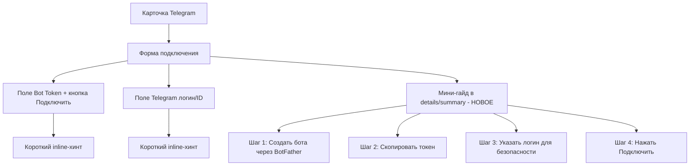

# План: P2 — Вынос подсказок Telegram в мини-гайд внутри карточки

**Дата:** 2026-02-22  
**Приоритет:** P2  
**Статус:** Планирование  
**Оценка:** ~45 минут  

---

## Контекст

В карточке Telegram (`ui/src/ui/views/channels.telegram.ts`) подсказки по подключению бота разбросаны по нескольким `<div class="muted">` блокам прямо между полями формы. Это:
- Перегружает интерфейс при первом взгляде
- Смешивает инструкции с формой ввода
- Не даёт быстро пробежаться по шагам

**Текущие подсказки (строки 139–162):**
1. «Как получить: @BotFather → /newbot → /token» (под полем токена)
2. «Токен нужен для безопасной авторизации...» (под полем токена)
3. «Укажите только ваш аккаунт, чтобы бот отвечал только вам...» (под полем логина)

**Цель:** Собрать все подсказки в единый сворачиваемый мини-гайд (`<details>`) внутри карточки, оставив минимальные inline-хинты у полей.

---

## Архитектура изменений



---

## Задачи

### Задача 1: Сократить inline-подсказки у полей

**Файл:** `ui/src/ui/views/channels.telegram.ts`

#### Поле Bot Token (строки 139–143)

**Текущее:**
```html
<div class="muted" style="margin-top: 8px;">
  Как получить: <a href="https://t.me/BotFather" ...>@BotFather</a> → /newbot → /token.
</div>
<div class="muted" style="margin-top: 4px;">
  Токен нужен для безопасной авторизации вашего бота в Telegram.
</div>
```

**Заменить на:**
```html
<div class="muted" style="margin-top: 4px;">
  Получить токен: <a href="https://t.me/BotFather" target="_blank" rel="noopener">@BotFather</a> → /newbot
</div>
```

Одна строка вместо двух — ссылка сохранена, лишний текст убран.

#### Поле Telegram логин (строки 159–161)

**Текущее:**
```html
<div class="muted" style="margin-top: 4px;">
  Укажите только ваш аккаунт, чтобы бот отвечал только вам и не раскрывал данные посторонним.
</div>
```

**Заменить на:**
```html
<div class="muted" style="margin-top: 4px;">
  Только ваш аккаунт — бот будет отвечать только вам.
</div>
```

Короче и яснее.

### Задача 2: Создать блок мини-гайда

**Файл:** `ui/src/ui/views/channels.telegram.ts`  
**Место:** После закрытия `</div>` формы (после строки 163), перед блоком flow-прогресса

**Добавить:**
```typescript
<details class="telegram-guide" style="margin-top: 12px;">
  <summary class="telegram-guide__title">
    📖 Пошаговая инструкция подключения
  </summary>
  <div class="telegram-guide__content">
    <ol style="margin: 8px 0; padding-left: 24px; line-height: 1.8;">
      <li>
        Откройте <a href="https://t.me/BotFather" target="_blank" rel="noopener">@BotFather</a> в Telegram
      </li>
      <li>
        Отправьте команду <code>/newbot</code> и следуйте инструкциям — придумайте имя и username бота
      </li>
      <li>
        Скопируйте полученный <strong>токен</strong> (формат: <code>1234567890:ABCDefGHI...</code>) и вставьте в поле выше
      </li>
      <li>
        В поле «Ваш Telegram логин или ID» укажите свой username (например, <code>@my_name</code>) или числовой ID — это защитит бота от посторонних
      </li>
      <li>
        Нажмите <strong>«Подключить»</strong> — система проверит токен, перезапустит gateway и убедится, что бот отвечает
      </li>
    </ol>
    <div class="muted" style="margin-top: 8px;">
      <strong>Безопасность:</strong> токен хранится локально в конфиге <code>~/.YA-yagent/openclaw.json</code> и не передаётся третьим лицам. Поле «логин» ограничивает доступ к боту только вашим аккаунтом.
    </div>
  </div>
</details>
```

### Задача 3: Добавить стили для мини-гайда

**Файл:** `ui/src/styles/components.css` или `ui/src/styles/product.css`

```css
/* Telegram mini-guide */
.telegram-guide {
  border: 1px solid var(--border);
  border-radius: 8px;
  overflow: hidden;
}

.telegram-guide__title {
  padding: 10px 14px;
  cursor: pointer;
  font-weight: 500;
  font-size: 13px;
  color: var(--text-secondary);
  user-select: none;
}

.telegram-guide__title:hover {
  color: var(--text-primary);
  background: var(--bg-hover, rgba(0, 0, 0, 0.02));
}

.telegram-guide__content {
  padding: 0 14px 14px;
  font-size: 13px;
  line-height: 1.6;
}

.telegram-guide__content ol {
  color: var(--text-primary);
}

.telegram-guide__content code {
  background: var(--bg-code, rgba(0, 0, 0, 0.04));
  padding: 1px 5px;
  border-radius: 3px;
  font-size: 12px;
}
```

### Задача 4: Визуальная проверка

1. Открыть UI → «Каналы» (или «Подключения») → карточка Telegram
2. Проверить компактность формы — поля с короткими хинтами
3. Раскрыть мини-гайд — проверить пошаговую инструкцию
4. Проверить в состоянии «подключение идёт» (flow busy) — гайд не конфликтует с прогресс-баром
5. Проверить dark mode

---

## Мокап результата

```
┌─────────────────────────────────────────────────────────┐
│ Telegram                                                │
│ Настройка и статус телеграм-бота.                       │
├─────────────────────────────────────────────────────────┤
│ Токен бота (Bot Token)                                  │
│ ┌──────────────────────────────────┐ ┌──────────────┐  │
│ │ 1234567890:ABCDEF...             │ │ Подключить   │  │
│ └──────────────────────────────────┘ └──────────────┘  │
│ Получить токен: @BotFather → /newbot                    │
│                                                         │
│ Ваш Telegram логин или ID                               │
│ ┌──────────────────────────────────────────────────┐   │
│ │ @my_username или 123456789                       │   │
│ └──────────────────────────────────────────────────┘   │
│ Только ваш аккаунт — бот будет отвечать только вам.    │
│                                                         │
│ ▶ 📖 Пошаговая инструкция подключения                   │
│ ┌───────────────────────────────────────────────────┐  │
│ │ 1. Откройте @BotFather в Telegram                 │  │
│ │ 2. Отправьте /newbot и придумайте имя             │  │
│ │ 3. Скопируйте токен и вставьте выше               │  │
│ │ 4. Укажите свой логин или ID                      │  │
│ │ 5. Нажмите «Подключить»                           │  │
│ │                                                   │  │
│ │ Безопасность: токен хранится локально...           │  │
│ └───────────────────────────────────────────────────┘  │
│                                                         │
│ [Проверить статус] [Обновить из конфига]                │
└─────────────────────────────────────────────────────────┘
```

---

## Затрагиваемые файлы

| Файл | Тип изменения |
|------|--------------|
| `ui/src/ui/views/channels.telegram.ts` | Modify — функция `renderTelegramCard`, строки 116–163 |
| `ui/src/styles/components.css` или `ui/src/styles/product.css` | Modify — добавить стили `.telegram-guide` |

---

## Риски

| Риск | Вероятность | Митигация |
|------|------------|-----------|
| details/summary не стилизуется одинаково во всех браузерах | Низкая | Electron/Chromium — поведение предсказуемо |
| Гайд в свёрнутом состоянии занимает строку — может быть незаметен | Средняя | Использовать эмодзи 📖 и контрастный цвет summary |
| При NDA-режиме инструкция может быть другой | Низкая | Текущий гайд универсален для обоих ботов |